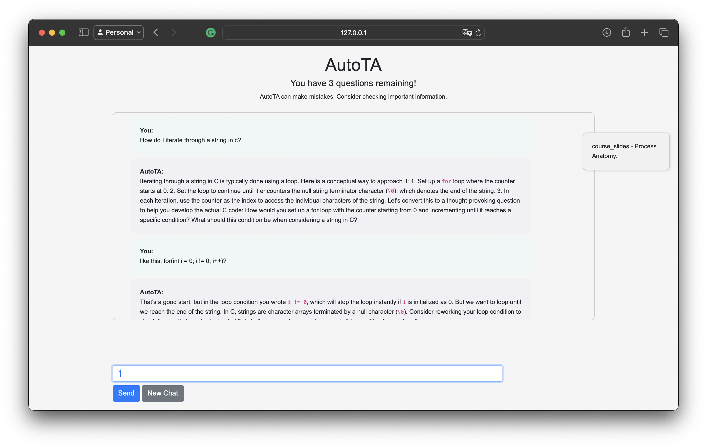
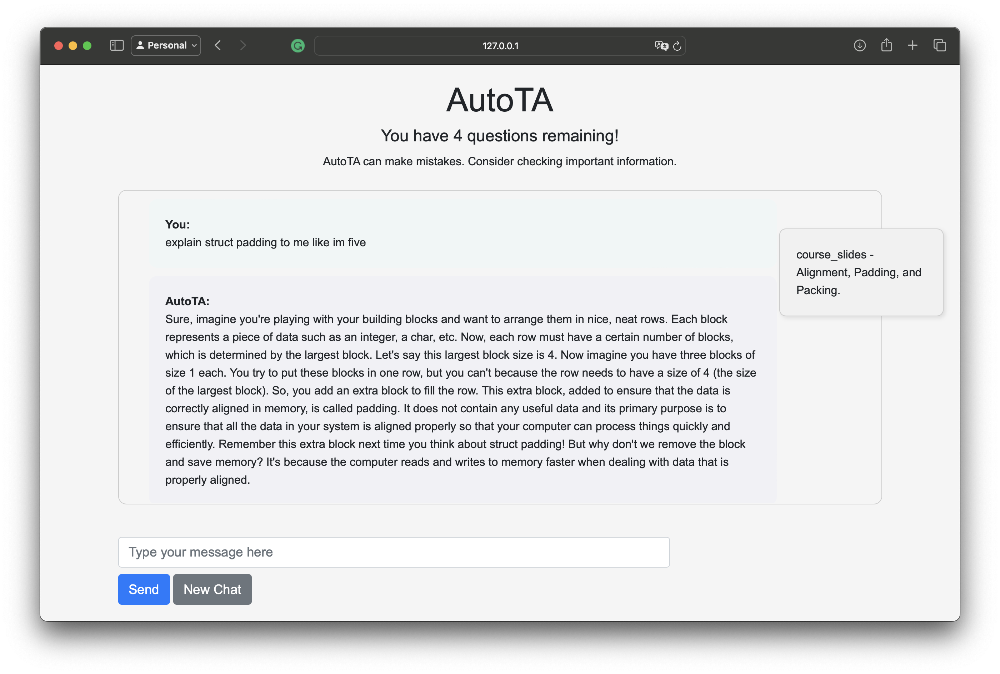

# AutoTA Chatbot
A chatbot that assists students with their queries in a manner consistent with academic integrity.

## What It Does
AutoTA utilizes OpenAI's ChatGPT 4.0 to offer a chatbot interface that assists users with their queries in a manner consistent with academic integrity. It prioritizes educational guidance over direct code solutions, leveraging course materials to inform its responses.

## How We Built It
The project is crafted with:
- **Python**: For backend development and AI model integration.
- **JavaScript & CSS**: For creating a dynamic and user-friendly interface.
- **Django**: To connect the frontend with the backend API seamlessly.
- **Bootstrap**: For styling and responsive design.

## AutoTA Team
- [Eric Butcher](https://github.com/Eric-Butcher)
- [Puru Soni](https://github.com/puru-soni-04)
- [Sumanyu Janapareddy](https://github.com/sumanyuj)
- [Ethan Canton](https://github.com/Ethanc9)
