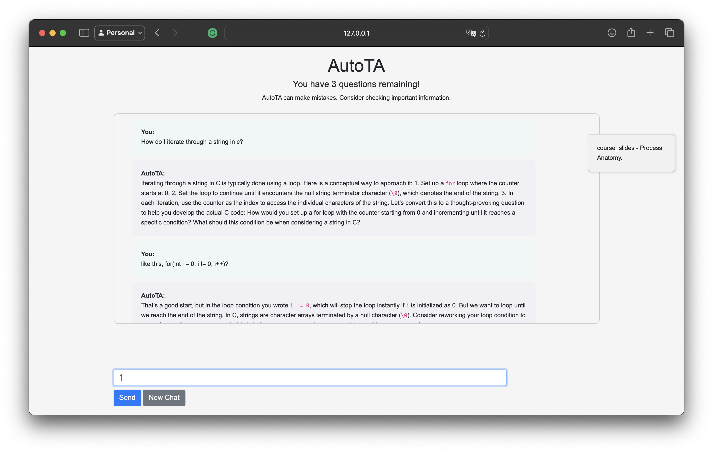

# AutoTA Chatbot
A chatbot that assists students with their queries in a manner consistent with academic integrity.

## Table of Contents
- [Inspiration](#inspiration)
- [What It Does](#what-it-does)
- [How We Built It](#how-we-built-it)
- [Challenges We Ran Into](#challenges-we-ran-into)
- [Accomplishments That We're Proud Of](#accomplishments-that-were-proud-of)
- [What We Learned](#what-we-learned)
- [What's Next for AutoTA](#whats-next-for-autota)
- [Built With](#built-with)
- [AutoTA Team](#autota-team)

## Inspiration
Inspired by the cutting-edge chatbots like Harvard's CS50 AI and Khan Academy's Khanmigo, AutoTA aims to enhance the academic experience by providing an interactive learning assistant.

## What It Does
AutoTA utilizes OpenAI's ChatGPT 4.0 to offer a chatbot interface that assists users with their queries in a manner consistent with academic integrity. It prioritizes educational guidance over direct code solutions, leveraging course materials to inform its responses.

## How We Built It
The project is crafted with:
- **Python**: For backend development and AI model integration.
- **JavaScript & CSS**: For creating a dynamic and user-friendly interface.
- **Django**: To connect the frontend with the backend API seamlessly.
- **Bootstrap**: For styling and responsive design.

## Challenges We Ran Into
Our journey was met with challenges such as navigating Django's structure and developing dynamic HTML pages. We also had to learn how to use OpenAI's API and integrate it with our project. Prompt Engineering was a key challenge, as we had to find the right balance between specificity and generality to ensure that the chatbot's responses were relevant to the user's query while also being consistent with academic integrity.

## Accomplishments That We're Proud Of
We successfully created a Django-based application and acedemic integrity upholding chatbot that can be effectively used in educational settings.

## What We Learned
This project was an invaluable opportunity to learn about teamwork in software development, and to deepen our understanding of new frameworks and programming practices.

## What's Next for AutoTA
We aim to refine the chatbot's tuning to better reflect the approach of instructors who, with the goal of expanding its use across various introductory CSE courses.

We have teamed up with several professors and  are currently plannng to do beta testing with students and instructors to gather feedback and improve the chatbot's performance over the winter semester.

## AutoTA Team
- [Eric Butcher](https://github.com/Eric-Butcher)
- [Puru Soni](https://github.com/puru-soni-04)
- [Sumanyu Janapareddy](https://github.com/sumanyuj)
- [Ethan Canton](https://github.com/Ethanc9)